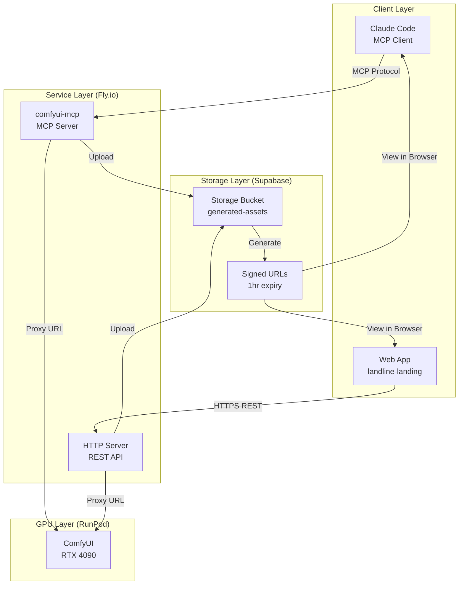

# ComfyUI MCP Server

<div align="center">


*Yes, this image was generated by the tool. Yes, we know AI art is ethically fraught at best and genuinely dangerous at worst. We built this for internal asset generation, not to replace artists. Use responsibly or don't use at all.*

</div>

---

**When your Mac renders black frames, you learn to distribute.**

I wanted Claude to generate images through my local ComfyUI setup. Ran Sonic. Ten seconds of pure black frames. The GPU couldn't keep up.

So I distributed it.

The MCP server runs on Fly.io—stateless, auto-scaling. GPU compute lives on RunPod, pay-per-second. Generated assets go to Supabase with signed URLs. Tailscale meshes it all together securely. What started as "let me generate some images" became a production distributed system because the alternative was a space heater that outputs nothing.

Now Claude can generate images, upscale them, run ControlNet pipelines, synthesize speech, and create lip-synced talking head videos—all through natural conversation. **35+ tools. 467 tests. No API fees. Full parameter control.**

```
You: "Generate a cyberpunk cityscape at sunset and save it to ./assets/hero.png"

Claude: I'll generate that image for you.
        [Calls generate_image with prompt, saves to ./assets/hero.png]
        Done! The cyberpunk cityscape has been saved to ./assets/hero.png
```

## Features

- **🎨 Imagine Tool**: The ultimate generation tool—describe what you want in natural language and get optimized results with auto-detected model settings
- **Smart Prompting**: Auto-generates optimized prompts based on your model (Illustrious, Pony, Flux, SDXL, Realistic, SD1.5)
- **Pipeline Execution**: Chain txt2img → hi-res fix → upscale in a single command
- **Quality Presets**: From "draft" (fast) to "ultra" (full pipeline with upscaling)
- **Text-to-Image**: Generate images from text prompts with full parameter control
- **Image-to-Image**: Transform existing images with AI guidance
- **AI Upscaling**: Enhance resolution using RealESRGAN and other models
- **LoRA Support**: Apply custom style and character LoRAs with adjustable weights
- **Model Discovery**: List available checkpoints, LoRAs, samplers, and schedulers
- **Queue Monitoring**: Check generation status and pending jobs

## Prerequisites

- [ComfyUI](https://github.com/comfyanonymous/ComfyUI) running locally
- Node.js 18+
- At least one Stable Diffusion checkpoint model

## Quick Start

### 1. Clone and Install

```bash
git clone https://github.com/yourusername/comfyui-mcp.git
cd comfyui-mcp
npm install
```

### 2. Configure Claude Code

Add to `~/.claude/settings.json` (global) or `.claude/settings.local.json` (project-specific):

```json
{
  "mcpServers": {
    "comfyui": {
      "command": "npx",
      "args": ["-y", "tsx", "/absolute/path/to/comfyui-mcp/src/index.ts"],
      "env": {
        "COMFYUI_URL": "http://localhost:8188",
        "COMFYUI_MODEL": "dreamshaper_8.safetensors"
      }
    }
  }
}
```

> **Note**: Replace `/absolute/path/to/comfyui-mcp` with the actual path where you cloned this repo.

### 3. Start ComfyUI

Ensure ComfyUI is running at the configured URL (default: http://localhost:8188).

### 4. Restart Claude Code

**Important**: Claude Code loads MCP servers at startup. You must restart Claude Code (exit and relaunch) after adding the configuration.

### 5. Generate Images

Start generating:

```
"Generate a portrait with warm lighting and save it to ./images/portrait.png"
```

## Available Tools

### generate_image

Generate an image from a text prompt (txt2img).

| Parameter | Type | Default | Description |
|-----------|------|---------|-------------|
| prompt | string | required | What to generate |
| negative_prompt | string | "bad quality, blurry" | What to avoid |
| width | number | 512 | Image width in pixels |
| height | number | 768 | Image height in pixels |
| steps | number | 28 | Sampling steps |
| cfg_scale | number | 7 | Classifier-free guidance scale |
| sampler | string | "euler_ancestral" | Sampling algorithm |
| scheduler | string | "normal" | Noise scheduler |
| model | string | env default | Checkpoint model name |
| seed | number | random | Random seed for reproducibility |
| loras | array | none | LoRAs to apply (see below) |
| output_path | string | required | Where to save the image |
| upload_to_cloud | bool | true | Upload to cloud storage and return signed URL |

**Returns:** `{ success, path, remote_url?, seed, message }`

When `upload_to_cloud` is true and cloud storage is configured, `remote_url` contains a signed URL valid for 1 hour.

**LoRA format:**
```json
{
  "name": "style_lora.safetensors",
  "strength_model": 0.8,
  "strength_clip": 0.8
}
```

### img2img

Transform an existing image with AI guidance.

| Parameter | Type | Default | Description |
|-----------|------|---------|-------------|
| prompt | string | required | What to generate |
| input_image | string | required | Filename in ComfyUI input folder |
| denoise | number | 0.75 | 0.0 = no change, 1.0 = full regeneration |
| output_path | string | required | Where to save the result |
| *(plus all txt2img params)* | | | |

### upscale_image

Upscale an image using AI upscaling models.

| Parameter | Type | Default | Description |
|-----------|------|---------|-------------|
| input_image | string | required | Filename in ComfyUI input folder |
| upscale_model | string | "RealESRGAN_x4plus.pth" | Upscaling model |
| target_width | number | native | Optional resize width |
| target_height | number | native | Optional resize height |
| output_path | string | required | Where to save the result |

### Discovery Tools

| Tool | Description |
|------|-------------|
| list_models | Available checkpoint models |
| list_loras | Available LoRA adapters |
| list_samplers | Sampling algorithms (euler, dpm++, etc.) |
| list_schedulers | Noise schedulers (normal, karras, etc.) |
| list_upscale_models | Upscaling models (RealESRGAN, etc.) |
| get_queue_status | Running and pending jobs |

### 🎨 imagine (Recommended!)

**The easiest way to generate images.** Describe what you want in natural language, and it handles everything: auto-detects your model family, crafts optimized prompts, applies quality presets, and runs the full pipeline.

| Parameter | Type | Default | Description |
|-----------|------|---------|-------------|
| description | string | required | Natural language description of what to generate |
| output_path | string | required | Where to save the final image |
| model | string | env default | Checkpoint model (auto-detected if not set) |
| model_family | string | auto | "illustrious", "pony", "flux", "sdxl", "realistic", "sd15" |
| style | string | none | "anime", "cinematic", "portrait", "landscape", etc. |
| artist_reference | string | none | Artist style, e.g., "studio ghibli" |
| quality | string | "standard" | "draft", "standard", "high", "ultra" |
| loras | array | none | LoRAs to apply |
| seed | number | random | For reproducibility |
| upload_to_cloud | bool | true | Upload to cloud and return signed URL |

**Returns:** `{ success, imagePath, remote_url?, seed, prompt, modelFamily, pipelineSteps, settings, message }`

**Quality presets:**
- `draft`: Fast generation, txt2img only
- `standard`: Balanced quality (default)
- `high`: Includes hi-res fix pass
- `ultra`: Full pipeline with hi-res fix + upscaling

### execute_pipeline

Run a multi-step generation pipeline: txt2img → hi-res fix → upscale.

| Parameter | Type | Default | Description |
|-----------|------|---------|-------------|
| prompt | string | required | The positive prompt |
| model | string | required | Checkpoint model |
| output_path | string | required | Final output location |
| enable_hires_fix | bool | false | Add img2img refinement pass |
| hires_denoise | number | 0.4 | Denoise for hi-res (0.3-0.5 recommended) |
| enable_upscale | bool | false | Add AI upscaling step |
| *(plus all txt2img params)* | | | |

### craft_prompt

Generate an optimized prompt from a natural description. Useful when you want to see/edit the prompt before generating.

| Parameter | Type | Default | Description |
|-----------|------|---------|-------------|
| description | string | required | Natural language description |
| model_name | string | none | For auto-detection of model family |
| model_family | string | auto | Explicit family override |
| style | string | none | Style preset to apply |
| rating | string | "safe" | Content rating (for Pony models) |

Returns: optimized positive prompt, negative prompt, recommended settings, LoRA suggestions.

### get_prompting_guide

Get tips and example prompts for a specific model family.

| Parameter | Type | Required | Description |
|-----------|------|----------|-------------|
| model_family | string | yes | "illustrious", "pony", "flux", etc. |

### list_prompting_strategies

List all supported model families and their prompting characteristics.

## Usage Examples

### Using Imagine (Recommended)

```
"Imagine a cozy coffee shop with warm lighting and plants,
save to ./assets/coffee_shop.png with high quality"
```

```
"Create an anime-style portrait of a warrior princess in a
fantasy setting, style: anime, quality: ultra"
```

```
"Generate a professional product photo of a sneaker on white
background using my realistic model, artist reference: apple product photography"
```

### Basic Generation

```
"Generate a mountain landscape at golden hour, save to ./assets/landscape.png"
```

### With LoRAs

```
"Create an anime-style portrait using the animeStyle.safetensors LoRA
at 0.8 strength, save to ./output/anime_portrait.png"
```

### Image Transformation

```
"Take the sketch in ComfyUI's input folder called sketch.png and turn
it into a detailed illustration with 0.7 denoise"
```

### Upscaling

```
"Upscale hero.png to 4K using RealESRGAN"
```

### Batch Workflow

```
"Generate 3 variations of a forest scene with different lighting:
1. Misty morning
2. Harsh noon sun
3. Sunset through trees
Save them to ./scenes/forest_*.png"
```

## Architecture

```
┌─────────────┐     MCP Protocol    ┌─────────────┐     REST/WS     ┌──────────┐
│   Claude    │ ◄─────────────────► │  MCP Server │ ◄─────────────► │ ComfyUI  │
│   (Client)  │    Tool Calls       │  (Bridge)   │   Workflows     │  (API)   │
└─────────────┘                     └─────────────┘                 └──────────┘
```

The MCP server:
1. Exposes tools to the AI client
2. Receives requests with parameters
3. Builds ComfyUI workflow JSON
4. Queues workflows via REST API
5. Monitors progress via WebSocket
6. Retrieves and saves generated images

### How ComfyUI Workflows Work

ComfyUI represents image generation as a graph of nodes. Each node performs an operation:

```
CheckpointLoader → CLIPTextEncode → KSampler → VAEDecode → SaveImage
       ↓                                ↑
    LoraLoader(s) ──────────────────────┘
```

Our server dynamically constructs these graphs based on your parameters. When you specify LoRAs, we inject LoraLoader nodes into the chain. The workflow is submitted as JSON to ComfyUI's `/prompt` endpoint.

### Why This Architecture

Some decisions here didn't come from the AI—they came from knowing what breaks at scale:

- **Distributed rate limiting (Upstash Redis)**: In-memory rate limiters fail when you have multiple Fly.io instances. Sliding window algorithm, tier-based limits, per-API-key with IP fallback.
- **Quirrel for long-running jobs**: Fly.io has connection limits (25 hard, 20 soft). Portrait generation, TTS, and lipsync run async through job queues. Otherwise HTTP timeouts kill requests.
- **Storage abstraction layer**: Single interface, three implementations (Supabase, GCP, local). Swap providers with an env var. No vendor lock-in.
- **Tailscale mesh**: RunPod URLs are public. Tailscale adds a security layer between Fly.io and the GPU node.
- **Strategy pattern for prompting**: Illustrious wants tags, Flux wants natural language, Pony needs score tags. Six model families, six strategies, auto-detected from checkpoint name. The alternative was unmaintainable spaghetti.

The AI suggested "use Playwright locally" for browser automation. That's not remotely plausible in a distributed context. Knowing *when* to distribute matters.

## Environment Variables

### Core

| Variable | Default | Description |
|----------|---------|-------------|
| COMFYUI_URL | http://localhost:8188 | ComfyUI API endpoint |
| COMFYUI_MODEL | (none) | Default checkpoint model |
| COMFYUI_OUTPUT_DIR | /tmp/comfyui-output | Fallback output directory |

### Cloud Storage (Optional)

| Variable | Default | Description |
|----------|---------|-------------|
| STORAGE_PROVIDER | (none) | Set to "supabase" to enable cloud uploads |
| SUPABASE_URL | (none) | Your Supabase project URL |
| SUPABASE_SECRET_KEY | (none) | Supabase service role key (sb_secret_...) |
| SUPABASE_BUCKET | generated-assets | Storage bucket name |

### HTTP Server

| Variable | Default | Description |
|----------|---------|-------------|
| PORT | 3001 | HTTP server port |
| NODE_ENV | development | Set to "production" for Fly.io |

## Project Structure

```
comfyui-mcp/
├── src/
│   ├── index.ts              # MCP server entry point (15 tools)
│   ├── comfyui-client.ts     # ComfyUI REST/WebSocket client
│   ├── workflows/
│   │   ├── txt2img.json      # Text-to-image template
│   │   ├── img2img.json      # Image-to-image template
│   │   ├── upscale.json      # Upscaling template
│   │   └── builder.ts        # Workflow parameterization & LoRA injection
│   ├── prompting/            # Smart prompt generation system
│   │   ├── generator.ts      # Main PromptGenerator class
│   │   ├── model-detection.ts# Auto-detect model family
│   │   ├── types.ts          # Type definitions
│   │   └── strategies/       # Per-model prompting strategies
│   │       ├── illustrious.ts
│   │       ├── pony.ts
│   │       ├── flux.ts
│   │       ├── sdxl.ts
│   │       ├── realistic.ts
│   │       └── sd15.ts
│   └── tools/
│       ├── imagine.ts        # 🎨 Main generation tool
│       ├── pipeline.ts       # Multi-step pipeline executor
│       ├── craft-prompt.ts   # Prompt optimization tool
│       ├── generate.ts       # generate_image, img2img
│       ├── upscale.ts        # upscale_image, list_upscale_models
│       ├── list-models.ts    # Model discovery tools
│       └── queue-status.ts   # Queue monitoring
├── docs/
│   └── UAT.md                # User acceptance testing guide
├── package.json
├── tsconfig.json
├── vitest.config.ts          # Test configuration
├── ARTICLE.md                # Full tutorial article
└── README.md
```

## Development

```bash
# Install dependencies
npm install

# Run in development mode
npm run dev

# Build for production
npm run build

# Run production build
npm start

# Run tests
npm test

# Run tests in watch mode
npm run test:watch

# Run tests with coverage
npm run test:coverage
```

**467 tests** covering all tools, prompting strategies, storage providers, and pipeline execution.

## Troubleshooting

### Tools not showing in Claude Code
1. Ensure you've restarted Claude Code after adding the MCP configuration
2. Check that the path to `src/index.ts` is absolute and correct
3. Verify the server starts manually: `npx tsx /path/to/src/index.ts` (should print "ComfyUI MCP server running on stdio")
4. Try killing all Claude Code instances and restarting fresh

### "Connection refused"
Ensure ComfyUI is running at the configured COMFYUI_URL.

### "Model not found"
Run `list_models` to see available checkpoints. Model names must match exactly, including file extension.

### "No image in output"
Check ComfyUI's web interface for workflow errors. The queued prompt may have failed due to missing nodes or invalid parameters.

### Slow generation
Generation time depends on hardware, model size, and step count. Reduce steps for faster drafts.

### LoRA not applying
Verify the LoRA filename with `list_loras`. Ensure strength values are reasonable (0.5-1.2 typically).

## Extending

The codebase is designed for extension:

- **ControlNet**: Add conditioning workflows in `src/workflows/` and corresponding tools
- **Inpainting**: Extend img2img with mask support
- **Video**: ComfyUI supports AnimateDiff—same workflow pattern applies
- **Custom nodes**: Any ComfyUI custom node can be integrated into workflow templates

## Cloud Deployment

### Architecture Overview



### How It Works

1. **Client Request**: Claude Code (via MCP) or web apps (via HTTP) send generation requests
2. **Service Processing**: The service builds ComfyUI workflows and queues them
3. **GPU Execution**: RunPod executes the workflow on a rented GPU (RTX 4090)
4. **Cloud Storage**: Results are uploaded to Supabase Storage
5. **Signed URLs**: A 1-hour signed URL is returned for secure browser viewing

### RunPod Setup

Don't have a local GPU? Run ComfyUI on RunPod and connect remotely.

1. Create a RunPod pod with PyTorch template
2. SSH in and run:
```bash
curl -fsSL https://raw.githubusercontent.com/YOUR_REPO/main/deploy/quick-deploy.sh | bash -s -- --dreamshaper
```
3. Get your pod URL: `https://<POD_ID>-8188.proxy.runpod.net`
4. Configure locally:
```bash
./deploy/scripts/configure-local.sh https://<POD_ID>-8188.proxy.runpod.net
```

See [deploy/README.md](./deploy/README.md) for detailed instructions.

### Cloud Storage (Supabase)

Generated images can be automatically uploaded to Supabase Storage with signed URLs for secure sharing.

**Setup:**
1. Create a Supabase project
2. Create a storage bucket named `generated-assets`
3. Add the RLS policy: `true` (or `auth.role() = 'service_role'` for restricted access)
4. Set environment variables (see below)

**Usage:**
- MCP tools (`imagine`, `generate_image`) include `upload_to_cloud: true` by default
- Results include a `remote_url` field with a 1-hour signed URL
- URLs can be opened directly in browsers for viewing

### HTTP Server (Web Integration)

For web apps that can't use MCP directly, an HTTP server is available:

```bash
# Start the HTTP server
npm run serve
# or
node dist/http-server.js
```

**Endpoints:**

| Endpoint | Method | Description |
|----------|--------|-------------|
| `/health` | GET | Health check with GPU info |
| `/imagine` | POST | Natural language image generation |
| `/image` | POST | Direct txt2img generation |
| `/portrait` | POST | AI portrait generation |
| `/tts` | POST | Text-to-speech with F5-TTS |
| `/lipsync` | POST | Video lip-sync with MuseTalk |

**Example:**
```bash
curl -X POST https://your-service.fly.dev/imagine \
  -H "Content-Type: application/json" \
  -d '{
    "description": "A cyberpunk cityscape at sunset",
    "output_path": "/tmp/cyberpunk.png"
  }'

# Response:
{
  "success": true,
  "imagePath": "/tmp/cyberpunk.png",
  "signedUrl": "https://xxx.supabase.co/storage/v1/object/sign/...",
  "seed": 1234567890,
  "message": "✨ Image generated successfully!"
}
```

### Fly.io Deployment

Deploy the HTTP server to Fly.io for production web integration:

```bash
# Install flyctl
curl -L https://fly.io/install.sh | sh

# Deploy
fly launch
fly secrets set \
  COMFYUI_URL="https://<POD_ID>-8188.proxy.runpod.net" \
  COMFYUI_MODEL="novaFurryXL.safetensors" \
  SUPABASE_URL="https://xxx.supabase.co" \
  SUPABASE_SECRET_KEY="sb_secret_xxx" \
  SUPABASE_BUCKET="generated-assets" \
  STORAGE_PROVIDER="supabase"

fly deploy
```

## Related

- [ComfyUI](https://github.com/comfyanonymous/ComfyUI) - The backend we're wrapping
- [MCP SDK](https://github.com/modelcontextprotocol/sdk) - The protocol implementation
- [Claude Code](https://claude.ai/code) - Primary MCP client

## License

MIT

---

**Full Tutorial**: See [ARTICLE.md](./ARTICLE.md) for a detailed walkthrough of building this server from scratch, including architecture decisions and implementation details.
